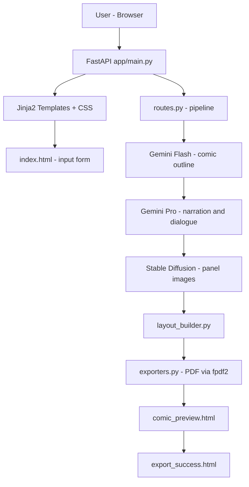
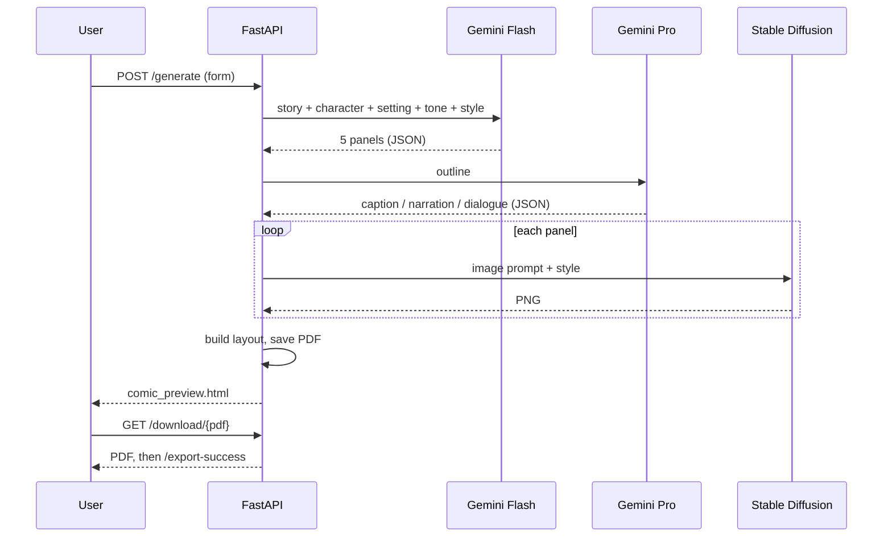

# Phase 3 – Project Design

## 1. System Architecture


## 2. Module Design
| File | Responsibility |
|------|----------------|
| `app/main.py` | Creates the FastAPI app, mounts `/static` |
| `app/routes.py` | All endpoints + `run_pipeline()` |
| `app/config.py` | Paths and environment variables |
| `app/gemini_client.py` | Shared Gemini call: JSON output, model fallback |
| `app/gemini_flash.py` | `generate_outline()` |
| `app/gemini_pro.py` | `generate_story()` |
| `app/image_generator.py` | `generate_image()` (lazy-loaded Stable Diffusion) |
| `app/layout_builder.py` | `build_comic_layout()` merges outline + story + images |
| `app/exporters.py` | `save_pdf()` |

## 3. Data Flow (per request)


## 4. API / Route Design
| Method | Route | Purpose |
|--------|-------|---------|
| GET | `/` | Input form |
| POST | `/generate` | Form submit → runs pipeline → preview page |
| POST | `/generate-comic/json` | Same pipeline, JSON in / JSON out |
| GET | `/download/{filename}` | Download exported PDF (name validated) |
| GET | `/export-success` | Success page |
| GET | `/test-image` | Generate a single test image |

## 5. Data Structures
```text
Outline panel : {panel, title, scene_description, image_prompt}
Story panel   : {panel, caption, narration, dialogue[]}
Layout panel  : {panel, title, scene_description, image_path, image_url,
                 caption, narration, dialogue[]}
```

## 6. UI Design
Three pages: **Input form** (5 fields + loading message) → **Comic preview** (title, image, italic scene
description, caption, narration, dialogue, download button) → **Export success** (confirmation + "Create another").
Screens are shown in [Phase 8](../08_Project_Demonstration_Phase).

## 7. Design Decisions
- Gemini returns **JSON** for both text steps → no fragile text splitting.
- `def` routes (not `async def`) so blocking AI calls run in FastAPI's thread pool.
- Model names come from `.env` with a fallback list.
- PDF download is validated (`comic_*.pdf` inside the exports folder only) to prevent path traversal.
